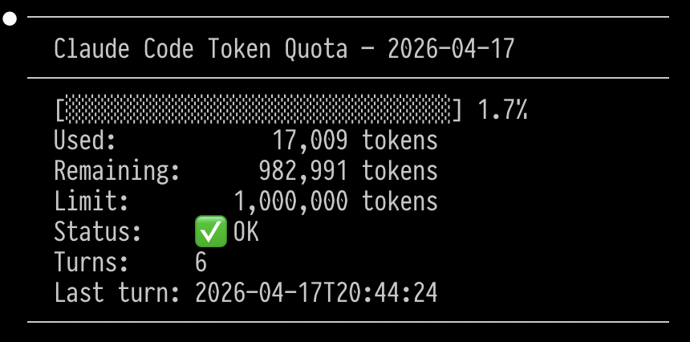
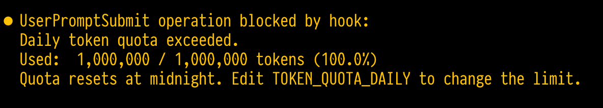

[](https://github.com/thedavidwhiteside/claude-code-tokenbudget/actions/workflows/test.yml)

# Claude Code Daily Token Quota Plugin

Claude Code has no built-in spending guardrails. This plugin tracks your daily token usage and hard stops new prompts once you hit your limit. It works with **any backend**: Bedrock, Vertex, direct API, or subscription.

## How it works

| Hook | Event | Action |
|------|-------|--------|
| `enforce_quota.py` | `UserPromptSubmit` | Blocks the prompt if today's usage ≥ limit |
| `track_tokens.py` | `Stop` | Records token usage after each turn |

Usage is stored in `~/.claude-token-quota/YYYY-MM-DD.json` and resets automatically each day.

---

## Installation

```bash
claude plugin marketplace add thedavidwhiteside/claude-code-tokenbudget
claude plugin install tokenbudget@claude-code-tokenbudget
```

This installs the plugin. It will be active in all future Claude Code sessions without any extra flags.

### Try before installing

If you want to test the plugin without a permanent install:

```bash
git clone https://github.com/thedavidwhiteside/claude-code-tokenbudget.git
cd claude-code-tokenbudget
claude --plugin-dir .
```

The plugin is active only for that session. Nothing is written to your global config.

## Uninstall

```bash
claude plugin uninstall tokenbudget@claude-code-tokenbudget
```

### Configuration

Override any of these in your `~/.claude/settings.json`:

```json
{
  "env": {
    "TOKEN_QUOTA_DAILY": "1000000",
    "TOKEN_QUOTA_DIR": "~/.claude-token-quota",
    "TOKEN_QUOTA_RETAIN_DAYS": "30"
  }
}
```

| Variable | Default | Description |
|---|---|---|
| `TOKEN_QUOTA_DAILY` | `1000000` | Daily token limit |
| `TOKEN_QUOTA_DIR` | `~/.claude-token-quota` | Where ledger files are stored |
| `TOKEN_QUOTA_RETAIN_DAYS` | `30` | How many days of usage history to keep |

**Rough token budgets by spend goal — AWS Bedrock example (Claude Sonnet 4.6):**

> **Note:** Prices below are AWS Bedrock examples only and will change. For current rates check the [AWS Bedrock pricing page](https://aws.amazon.com/bedrock/pricing/). Direct API users: see the [Anthropic pricing page](https://www.anthropic.com/pricing) for your model's rates, then apply the same blended-cost formula below.

Sonnet 4.6 standard pricing on Bedrock: ~$3.00 / 1M input tokens, ~$15.00 / 1M output tokens.
Assuming a ~4:1 input-to-output ratio, blended cost is roughly $5.40 / 1M tokens.

| Daily spend goal | ~Token budget |
|---|---|
| ~$5/day | 925,000 |
| ~$10/day | 1,850,000 |
| ~$20/day | 3,700,000 |

The default is 1,000,000 tokens/day (~$5.40/day at the example rates).

---

## Check status

Run `/tokenbudget:status` inside any Claude Code session to see today's usage.



When your quota is exceeded:



---

## FAQ

**Why not just set a spending limit in Claude.ai?**

Claude.ai spending limits only apply to your claude.ai subscription. If you're using Claude Code through the direct API, AWS Bedrock, or Vertex AI, those limits don't apply — your API key has no built-in cap. This plugin fills that gap by enforcing a hard stop at the Claude Code layer, regardless of which backend you're on.

---

## Caveats

- Token counts are read from the session transcript after each turn. They should be accurate but may differ slightly from your AWS bill due to rounding.
- The enforcer checks usage *before* a turn starts, so the very last turn before the limit may slightly exceed it (same behavior as Anthropic's own quota system).
- Requires Python 3.10+ (no external dependencies).

### Running tests

```bash
python3 -m unittest tests/test_plugin.py -v
```

---

## Contributing

See [CONTRIBUTING.md](CONTRIBUTING.md).
